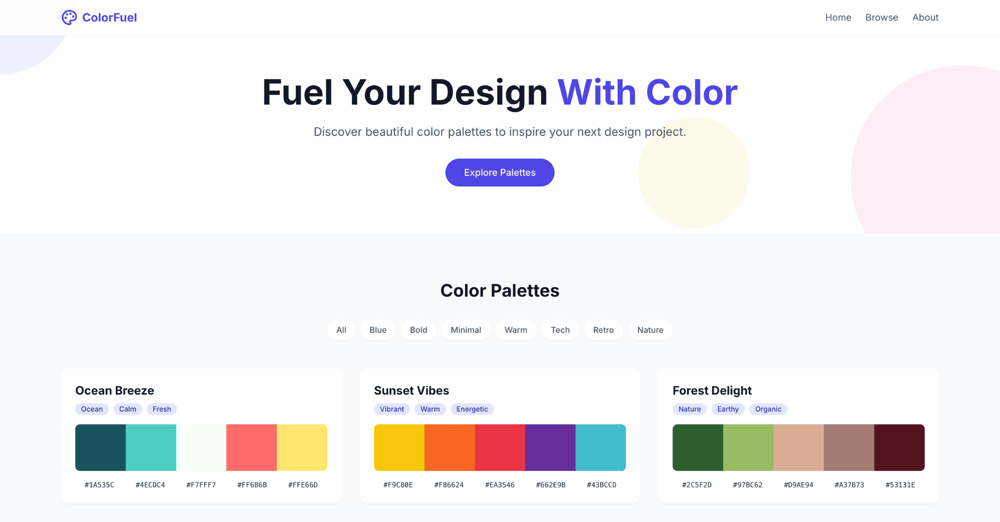

### ColorFuel

ColorFuel is a simple one-page color palette inspiration site made for designers, devs, or anyone who just wants some color ideas without overcomplicating things.

The idea started while bouncing around concepts in ChatGPT — trying to build something useful for graphic designers. I mocked up a few early layout ideas in Photopea and then generated the base layout using [Bolt.new](https://bolt.new).  

Full disclosure: I’m not a React developer — but I did go in and manually cleaned things up, added smooth scrolling, updated the header, fixed the logo scroll behavior, and tweaked spacing and styling to get it all working the way I wanted.

### Live Site  
👉 [colorfuel-design.netlify.app](https://colorfuel-design.netlify.app)

### Features

- Clean color palette previews with hex codes
- Visual tags (non-functional, just for style)
- Smooth scrolling navigation
- Sticky header with working logo click-to-top
- Mobile responsive
- Custom favicon

### Built With
- **ChatGPT / Photopea** – early idea/visual brainstorm
- **Bolt.new** – AI code starter (handled most of the layout)
- **React** – generated, but I updated the nav + logo functionality manually
- **Tailwind CSS** – mostly generated, but made tweaks to spacing, layout, and visuals
- **Netlify** – live deployment

### Why I Made It
I wanted to create something helpful and give fellow designers a quick reference resource for color inspiration.

### Sneak Peek

---

Made by [@cpuncekar](https://github.com/cpuncekar)
